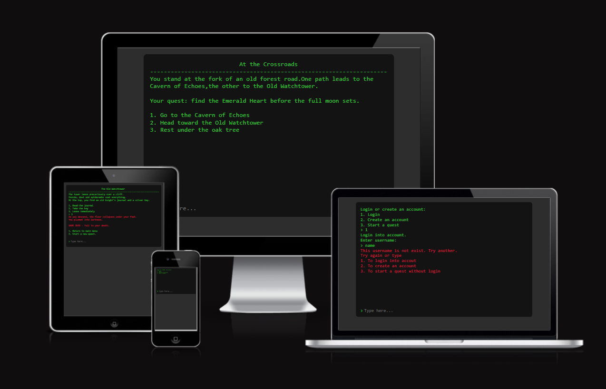
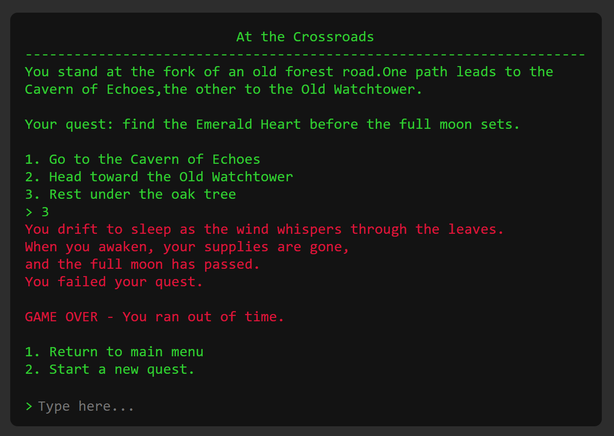
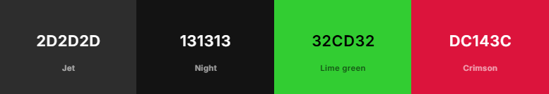
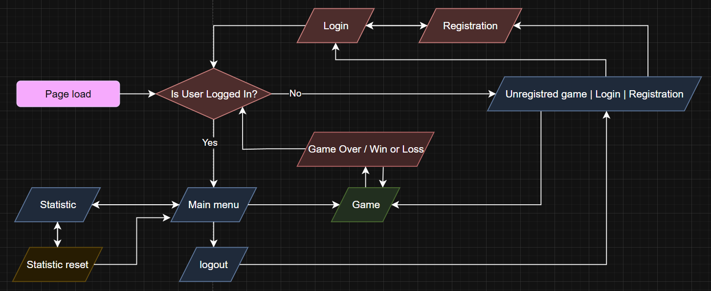

#  Emerald Heart - The Dragon's Lair

**Emerald Heart** is a web based interactive text adventure implemented with Python and Flask. The application presents a branching fantasy quest that users play through a terminal styled web interface. Game state and user data are persisted in MongoDB Atlas. The app is deployed on Render with Gunicorn as the WSGI server.



This project is **deployed on Render** and can be accessed at: **[https://emerald-heart.onrender.com/](https://emerald-heart.onrender.com/)**

#### Key principles:

- Simple and accessible gameplay flow that runs inside a browser
- Clear separation of front end presentation and back end flow control
- Persistent user data and session management for a reliable experience
- Easy to extend the quest flow and add new branches or game mechanics


## User Experience

### Overview

- The web UI emulates a terminal window where the user types commands or selects options. This provides an immersive, retro text adventure feel while remaining easy to use.

- Input from the user is sent to the Flask back end. The back end validates input, advances the game flow, and returns messages and instructions. The front end renders returned messages and highlights errors.

- The interface includes a typewrite animation to reveal narrative text gradually and enhance immersion.

- The application supports playing without creating an account as well as creating a persistent account for tracking progress and statistics.

### User flows

- **Guest play:** a user can start a new game immediately without authentication. Progress for guest sessions is ephemeral.

- **Registered play:** a user can create an account, log in, and have play history and statistics persisted between sessions.

- **Game flow:** the user receives a narrative message and a set of options. User input is validated, then the back end returns the next narrative message or an error message if input is invalid.

- **Error handling:** input errors and system errors are shown in the terminal UI as highlighted messages so the user can react immediately.

- **Session behavior:** a logged in user maintains a session across requests until logout. The session is used to map the user to saved game history and statistics.




## Features

### Implemented Features

- Terminal Look Interface
  - Terminal styled HTML layout that mimics a command line appearance
  - Styled text output with monospaced font and clear contrast

- Typewrite Animation
  - Progressive rendering of narrative text to simulate typing effect

- Play Without Account
  - Guest mode that allows immediate play without registration

- Create Account
  - Registration route with username and password input
  - Basic account management for sign up and sign in

- Secure Password Storage with bcrypt
  - Passwords hashed using bcrypt before being stored in MongoDB

- Stored Login Session
  - Session management to keep users authenticated across requests

- Multi-path Text Quest with Multiple Endings
  - Branching narrative with several endings, including multiple winning endings
  - One branching node with a 50/50 randomized outcome

- Quest History
  - Aggregated statistics for total games played, wins, and losses
  - Per user statistics persisted in MongoDB

- Ability to Reset Statistics
  - User facing action to clear or reset stored play statistics


### Future Features (Planned)
- More branches in the quest to increase replayability
- Items which affect the flow of the quest
- Ability to continue a game from the last checkpoint
- Selection shuffle to randomize available options between playthroughs
- User profiles displaying achievements, playtime, and past runs
- Disabling or interrupting typewrite animation for users who prefer faster text delivery.


## Testing and Bugfixing

For detailed information about testing, bugfixing, validation, please refer to **[TESTING.md](TESTING.md)**.


## Design

- **Visual Concept:**
  - The interface is styled to look like a classic command line terminal, maintaining a minimalist and immersive text adventure feel.
  - Layout is responsive and centered on the text interaction area to keep focus on the narrative flow.

- **Typography:**
  - Monospaced font for all interface text to reinforce the terminal aesthetic.
  - Clear contrast between text and background for readability in both light and dark conditions.

- **Color Palette:**



<!-- text version -->
BG Secondary `#2d2d2d`, BG Primary `#131313`, Text Primary `#32cd32`, Text Errors `#dc143c`

- **Animation and Feedback:**
  - The typewrite animation simulates real terminal output, enhancing immersion and pacing of story delivery.
  - Error and success messages are visually highlighted to give immediate feedback to player actions.

- **User Interface Structure:**
  - Input field positioned at the bottom of the screen to replicate terminal prompt behavior.
  - Scrolling text area displays story progression and feedback messages.
  - Simple transitions between game states for clarity and performance.


## Planning and Flow Control

- **Initial Planning:**
  - After completing the game script and storyline, several approaches to implementation and deployment were considered.
  - The main goals were to achieve a free to use deployment platform and a reliable free tier database for user data storage.

- **Platform Selection:**
  - Render was chosen as the hosting and deployment platform due to its free tier and straightforward setup for Flask applications.
  - MongoDB Atlas was selected for storing user accounts, sessions, and game statistics because of its free cluster availability and simple integration with Flask.

- **Design Transition:**
  - The project originally began as a console application. To retain the terminal experience in a web environment, a custom web based console was implemented using Flask for flow control and a browser interface for input and output.

- **Code Structuring:**
  - Defining the game logic and flow on paper using a simple schema in a sketchbook helped to structure the process before writing any code.
  - The sketched flow outlined narrative branches, possible endings, and how each player input would map to the next stage of the game.

- **Flowchart Reference:**
  - The flowchart illustrates the current flow and navigation paths, but not the in-game narrative flow.

    


## Technologies Used

### Languages

- **Python 3.12.10** – used for backend logic, routing, and game flow control
- **HTML5, CSS3, JavaScript ES8** – used for frontend presentation, styling, and handling user interactions with the terminal styled interface

### Python Packages

- **flask** – for backend routing, session management, and connection between frontend and backend
- **pymongo** for connecting and interacting with the MongoDB Atlas database
- **dotenv** for loading and managing environment variables securely
- **bcrypt** – for secure password hashing and verification
- **gunicorn** – for running the Flask application in a production environment on Render
- **pycodestyle** – for validating Python code style and ensuring PEP8 compliance

### Tools & Programs

- **[VS Code](https://code.visualstudio.com/)** – used as the main code editor for development
- **[Google Chrome](https://www.google.com/chrome/)** – utilized for browsing, testing, and verifying web functionality
- **[Chrome DevTools](https://developer.chrome.com/docs/devtools)** – used for debugging, testing features, and checking responsiveness
- **[Flake8 VSCode Extension](https://marketplace.visualstudio.com/items?itemName=ms-python.flake8)** – to maintain Python code in PEP8 standard
- **[Fork](https://fork.dev/)** – used as a Git client for version control and managing project commits

### Services

- **[Render](https://render.com/)** – used to deploy and host the Flask application with Gunicorn as the WSGI server, providing a free tier for reliable production deployment
- **[GitHub](https://github.com/)** – hosted the project repository for version control and collaboration
- **[GitHub Pages](https://pages.github.com/)** – used for deploying static documentation pages
- **[ChatGPT](https://chat.openai.com/)** – used to generate game story content, assist with research, and solve development problems
- **[Gemini](https://gemini.google.com/)** – used to create the site favicon and generate supporting content for documentation
- **[Am I Responsive](https://ui.dev/amiresponsive)** – used to create the responsive website mockup for this documentation
- **[diagrams.net](https://www.diagrams.net/)** – used to draw the project flowchart showing menu navigation and structure
- **[Coolors](https://coolors.co/)** – used to generate and document the website color palette


## Deployment & Local Development

### Deployment Process

Deploying **Emerald Heart** on **Render** from the GitHub repository is a straightforward process:

1. **Prepare the Repository:**
   - Ensure all files are committed and pushed to your GitHub repository.
   - The `requirements.txt` file should contain all project dependencies.

2. **Create a Render Account:**
   - Go to **[Render](https://render.com/)** and create a free account or log in if you already have one.

3. **Create a New Web Service:**
   - From the Render dashboard, click **New +** and select **Web Service**.
   - Choose **Build from a Git repository**.
   - Connect your **GitHub** account and select the project repository or use a direct link on it.

4. **Configure the Service:**
   - Set the **Environment** to **Python**.
   - In the **Build Command** field, enter:
     ```
     pip install -r requirements.txt
     ```
   - In the **Start Command** field, enter:
     ```
     gunicorn app:app
     ```

5. **Set Environment Variables:**
   - Under the **Environment Variables** section, add the following key-value pairs:
     - `MONGODB_CONNECTION_STRING` – your MongoDB Atlas connection string
     - `SESSION_SECRET_KEY` – a randomly generated secure string for Flask session encryption

6. **Deploy the Application:**
   - Click **Create Web Service**.
   - Render will automatically build and deploy your Flask app.
   - Once deployment is complete, you can access the live version using the Render-generated URL.

---
### Local Development

#### Cloning

To clone the **Emerald Heart** repository directly to your local machine:

1. Log in (or sign up) to GitHub.
2. Go to the repository for this project: **[sasha-fedorov/emerald-heart](https://github.com/sasha-fedorov/emerald-heart)**.
3. Click on the **Code** button (usually green), select your preferred cloning method (HTTPS, SSH, or GitHub CLI), and copy the provided link.
4. Open your **terminal** or **Git Bash**.
5. Navigate to the location where you want to create the project directory.
   - Example: `cd Documents/GitHub_Projects`
6. Type the following command and press **Enter**:

    ```
    git clone https://github.com/sasha-fedorov/emerald-heart.git
    ```
---

#### Forking

To fork the **Emerald Heart** repository to your own GitHub account:

1. Log in (or sign up) to GitHub.
2. Go to the repository: **[sasha-fedorov/emerald-heart](https://github.com/sasha-fedorov/emerald-heart)**.
3. Click the **Fork** button in the top right corner to create a copy under your own account.

---
#### Environment Setup

1. **Install Python:**
- Install **Python 3.12.10** or a compatible version from [python.org](https://www.python.org/).

2. **Create a Virtual Environment:**
- Navigate to your project directory in the terminal:
  ```
  cd emerald-heart
  ```
- Create and activate a virtual environment:
  - On Windows:
    ```
    python -m venv venv
    venv\Scripts\activate
    ```
  - On macOS/Linux:
    ```
    python3 -m venv venv
    source venv/bin/activate
    ```

3. **Install Dependencies:**
- Install the required Python packages from `requirements.txt`:
  ```
  pip install -r requirements.txt
  ```

4. **Create a `.env` File:**
- In the project root directory, create a file named `.env`.
- Add the following environment variables (replace placeholder values as needed):
  ```
  MONGODB_CONNECTION_STRING=your_mongodb_connection_string_here
  SESSION_SECRET_KEY=your_secret_session_key_here
  ```

5. **Run the Application Locally:**
- Start the Flask app with:
  ```
  flask run
  ```
- Access it in your browser at **http://127.0.0.1:5000/**


## Credits

### Resources and References

- **Gitignore Template:**
  Adapted from the official Python `.gitignore` provided by **[GitHub](https://github.com/github/gitignore/blob/main/Python.gitignore)**

- **Deployment Process Guide:**
  Followed the tutorial on deploying a Flask application to Render showed in this **[Youtube Video](https://www.youtube.com/watch?v=Dli5Hhgxq2Y)**

- **Terminal App Conception:**
  The idea for building a browser based terminal emulator in Flask was inspired by the discussion on **[Stack Overflow](https://stackoverflow.com/questions/78267668/how-to-make-a-terminal-emulator-in-flask)**