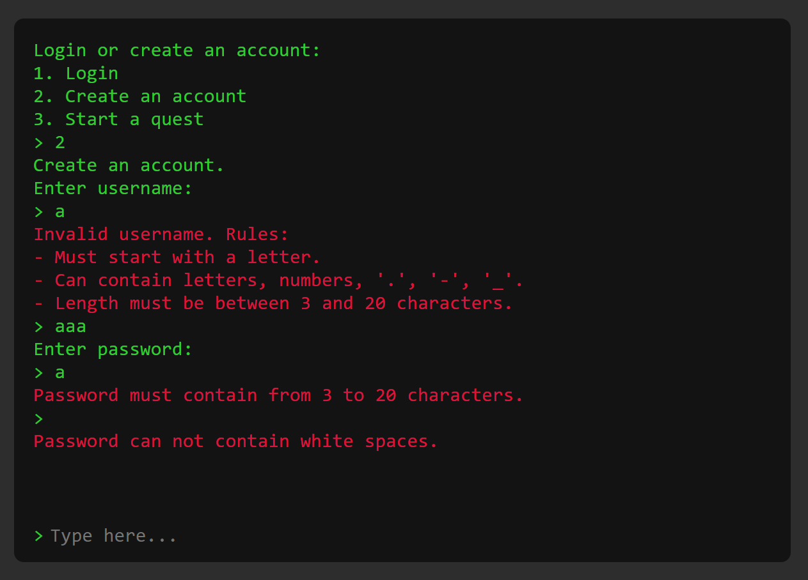
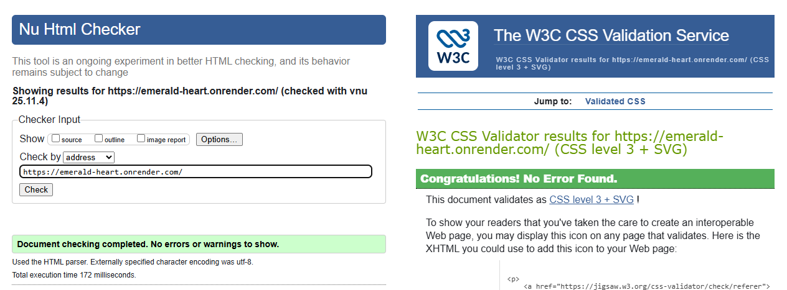
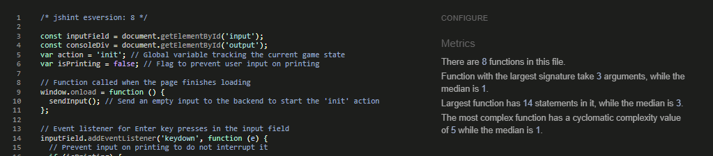

# Testing and Bugfixing

This document provides a comprehensive overview of the testing efforts for the Emerald Heart project.
It covers both automated and manual testing, highlighting tools and processes used to ensure code quality, functionality, and user experience.

The testing process ensures that the application performs reliably, is free of major errors, and delivers a consistent user experience across different platforms and devices.

## Automated testing

### Python

- **Code Style Validation:**
  - Python code was validated using the **Flake8** VS Code extension and the **pycodestyle** package to ensure compliance with PEP8 standards.
  - Both tools were run on the project’s current version.
  - **Result:** No syntax or style errors were detected in the latest build.

### HTML, CSS, JavaScript

- **HTML Validation:**
  - Current version passed validation with no detected errors. [Validation Link](https://validator.w3.org/nu/?doc=https%3A%2F%2Femerald-heart.onrender.com%2F)

- **CSS Validation:**
  - No CSS errors or compatibility issues found in the current version. [Validation Link](https://jigsaw.w3.org/css-validator/validator?uri=https%3A%2F%2Femerald-heart.onrender.com%2F&profile=css3svg&usermedium=all&warning=1&vextwarning=&lang=en)

- **JavaScript Validation:**
  - The JavaScript code for terminal input handling and animation passed validation with no issues reported.

## Manual Testing

### Menu Selections and Page Load

| Condition | Expected Action | Result |
|------------|----------------|---------|
| Page load - invalid session stored | Stored session value is deleted | Pass |
| Page load - no user associated with session found | Session is terminated | Pass |
| Page load - user session present | Main menu is loaded | Pass |
| Page load - no user session | Login/registration/unregistered menu is loaded | Pass |
| Main menu - logout selected | Logout confirmation is displayed | Pass |
| Logout confirmation - confirmed | Session terminated, login/registration/unregistered menu displayed | Pass |
| Logout confirmation - denied | Main menu displayed | Pass |
| Main menu - statistics selected | Statistics data displayed | Pass |
| Statistics menu - reset statistics selected | Reset statistics confirmation displayed | Pass |
| Reset statistics confirmation - confirmed | Statistics reset, updated statistics displayed | Pass |
| Reset statistics confirmation - denied | Statistics data displayed | Pass |
| Reset statistics - return to main menu selected | Main menu displayed | Pass |
| Login/registration/unregistered menu - login selected | Username input prompt displayed | Pass |
| Login/registration/unregistered menu - registration selected | Username input for registration displayed | Pass |
| Login/registration/unregistered menu - unregistered game selected | Information message about unsaved data displayed | Pass |
| Unregistered game data confirmation - confirmed | New game started | Pass |
| Unregistered game data confirmation - return to menu selected | Login/registration/unregistered menu displayed | Pass |
| Registration username - does not satisfy rules | Error message and rules displayed | Pass |
| Login username - does not satisfy rules | Error message and rules displayed | Pass |
| Login username - username not found | Error message and option to register displayed | Pass |
| Registration password - does not satisfy rules | Error message and rules displayed | Pass |
| Login password - does not satisfy rules | Error message, rules, and option to register displayed | Pass |
| Login password - does not match | Error message and option to register displayed | Pass |
| Login/registration - incorrect username or password | Option to start unregistered game displayed | Pass |
| Menus | All error messages are highlighted correctly | Pass |
| Game | All victory endings can be reached | Pass |
| Game | All game over endings can be reached | Pass |
| Game - path 31 | Player has a 50/50 chance of win or loss | Pass |
| Game victory | Victory message displayed | Pass |
| Game victory | Victory count increased | Pass |
| Game over | Game over message displayed | Pass |
| Game over | Game over count increased | Pass |
| Game victory or game over | Option to start a new game available | Pass |
| Game victory or game over | Logged-in and unregistered users see options appropriate to their status | Pass |

## Fixed Bugs and Issues

- **Issue:** Printing takes a while for large story displays
  - **Fix:** Increased printing speed (commit `2c83be8`)

- **Bug:** Game flow did not follow expected sequence (commits `25e512d`, `f8667b8`, `742be72`, `b88d822`)
  - **Fix:** Reordered game steps to match the intended flow

- **Bug:** Input printing could interrupt error message display
  - **Fix:** Added `.then` to ensure print completion before continuing (commit `8f28dc3`)

- **Bug:** Some printed messages overlapped or mixed together
  - **Fix:** Reworked printing method to use async/await and ensure sequential rendering (commit `4b9e16c`)

- **Bug:** After modifying printing logic, error messages lost highlighting
  - **Fix:** Created a `span` element for error output and printed errors inside it (commit `8f28dc3`)

- **Bug:** User input interrupted ongoing message printing
  - **Fix:** Introduced `isPrinting` flag set at print start and checked during input handling (commit `ef285ef`)

- **Bug:** Some action responses were missing or incorrect
  - **Fix:** Corrected and completed missing responses (commit `d69ad02`)

- **Bug:** Handling incorrect password advanced to the next action unexpectedly
  - **Fix:** Adjusted logic to properly reset actions after invalid password input (commit `d69ad02`)

- **Bug:** Not all login password errors were properly handled
  - **Fix:** Improved error handling flow to catch all cases (commit `d69ad02`)

- **Bug:** After moving user creation into a separate method, the method was not called correctly
  - **Fix:** Added correct method call (commits `e3db176`, `81e0355`)

- **Bug:** Username and password inputs were being lowercased
  - **Fix:** Removed `.strip().lower()` from input handling (commit `dbd4c46`)

### Additional Notes

Beyond these, numerous smaller improvements and quick fixes were made throughout development.
Many minor and major bugs were identified and resolved within minutes of discovery and may not be individually listed here.
For complete details, refer to the project’s commit history.

## Bugs to Fix

- **Autoscroll on Mobile:**
  Automatic scrolling does not always trigger correctly on mobile devices, causing new text to appear out of view.

- **Line Width on iPad:**
  The rendered terminal text area is narrower than intended on iPad screens, resulting in premature line breaks and misaligned text display.

